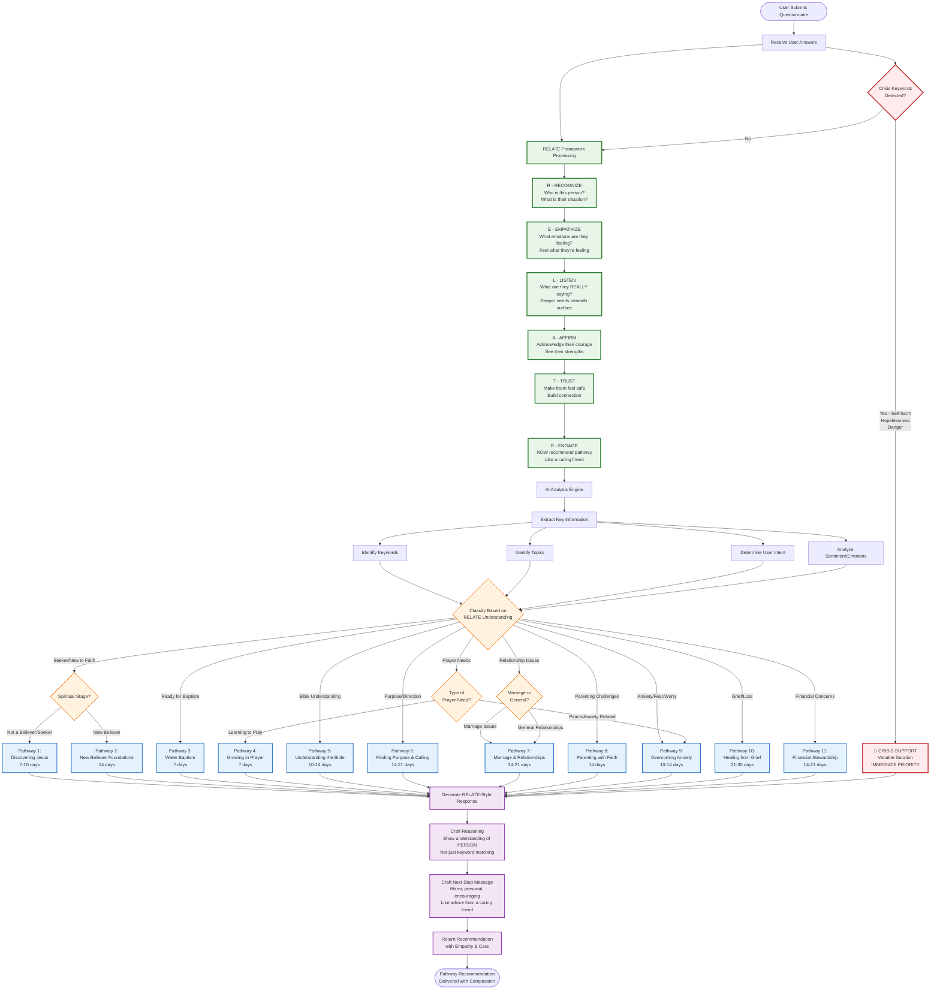

# LogosReach Pathway Recommendation Flowchart

## The RELATE Framework Flow



---

## RELATE Framework Detail

```
┌─────────────────────────────────────────────────────────────────────────────┐
│                        THE RELATE FRAMEWORK                                  │
│              "Build Relationship First, Then Recommend"                      │
└─────────────────────────────────────────────────────────────────────────────┘

    Before ANY pathway recommendation, the AI processes through ALL stages:

    ╔═══════════════════════════════════════════════════════════════════════╗
    ║  R ─ RECOGNIZE                                                         ║
    ╠═══════════════════════════════════════════════════════════════════════╣
    ║  • Who is this person from their answers?                              ║
    ║  • What is their current life situation?                               ║
    ║  • Are they new to faith or experienced?                               ║
    ║  • NO teaching or advice yet - just understanding                      ║
    ╚═══════════════════════════════════════════════════════════════════════╝
                                    │
                                    ▼
    ╔═══════════════════════════════════════════════════════════════════════╗
    ║  E ─ EMPATHIZE                                                         ║
    ╠═══════════════════════════════════════════════════════════════════════╣
    ║  • Reflect their emotions (anxiety, grief, hope, fear, curiosity)      ║
    ║  • Put yourself in their shoes                                         ║
    ║  • Validate feelings without judgment                                  ║
    ║  • NO scripture quotes or solutions yet                                ║
    ╚═══════════════════════════════════════════════════════════════════════╝
                                    │
                                    ▼
    ╔═══════════════════════════════════════════════════════════════════════╗
    ║  L ─ LISTEN                                                            ║
    ╠═══════════════════════════════════════════════════════════════════════╣
    ║  • What are they REALLY saying beneath the surface?                    ║
    ║  • What's the deeper need not explicitly stated?                       ║
    ║  • Read between the lines with compassion                              ║
    ║  • Listen 80%, speak 20%                                               ║
    ╚═══════════════════════════════════════════════════════════════════════╝
                                    │
                                    ▼
    ╔═══════════════════════════════════════════════════════════════════════╗
    ║  A ─ AFFIRM                                                            ║
    ╠═══════════════════════════════════════════════════════════════════════╣
    ║  • Affirm their courage in sharing/seeking help                        ║
    ║  • Highlight strengths you notice in them                              ║
    ║  • Seeking help IS strength - acknowledge this                         ║
    ║  • Still NO theology or pathways                                       ║
    ╚═══════════════════════════════════════════════════════════════════════╝
                                    │
                                    ▼
    ╔═══════════════════════════════════════════════════════════════════════╗
    ║  T ─ TRUST                                                             ║
    ╠═══════════════════════════════════════════════════════════════════════╣
    ║  • Build safety and credibility                                        ║
    ║  • Make them feel seen and understood                                  ║
    ║  • They need to know someone cares                                     ║
    ║  • Create connection through words                                     ║
    ╚═══════════════════════════════════════════════════════════════════════╝
                                    │
                                    ▼
    ╔═══════════════════════════════════════════════════════════════════════╗
    ║  E ─ ENGAGE                                                            ║
    ╠═══════════════════════════════════════════════════════════════════════╣
    ║  • ONLY NOW introduce pathway recommendation                           ║
    ║  • Like advice from a caring friend, not an algorithm                  ║
    ║  • Explain WHY this pathway fits THEIR unique journey                  ║
    ║  • Warm, personal, encouraging message                                 ║
    ╚═══════════════════════════════════════════════════════════════════════╝
```

---

## Crisis Detection Flow

```
┌─────────────────────────────────────────────────────────────────────────────┐
│                      ⚠️  CRISIS DETECTION  ⚠️                                │
│                        (HIGHEST PRIORITY)                                    │
└─────────────────────────────────────────────────────────────────────────────┘

                        USER ANSWERS
                             │
                             ▼
              ┌──────────────────────────────┐
              │     SCAN FOR CRISIS          │
              │     INDICATORS               │
              └──────────────────────────────┘
                             │
            ┌────────────────┴────────────────┐
            │                                 │
            ▼                                 ▼
    ┌───────────────┐                 ┌───────────────┐
    │ CRISIS        │                 │ NO CRISIS     │
    │ DETECTED      │                 │ DETECTED      │
    └───────┬───────┘                 └───────┬───────┘
            │                                 │
            ▼                                 ▼
    ┌───────────────────────┐         ┌───────────────────────┐
    │ INDICATORS:           │         │ Continue with         │
    │ • "end my life"       │         │ normal RELATE         │
    │ • "no point"          │         │ framework             │
    │ • "want to die"       │         │ processing            │
    │ • "give up"           │         │                       │
    │ • severe hopelessness │         │                       │
    │ • abuse/danger        │         │                       │
    └───────┬───────────────┘         └───────────────────────┘
            │
            ▼
    ┌───────────────────────────────────────────────────────────┐
    │  🚨 IMMEDIATE ACTION:                                      │
    │  ─────────────────────────────────────────────────────────│
    │  • ALWAYS recommend "Crisis Support" pathway               │
    │  • Override all other pathway logic                        │
    │                                                            │
    │  next_step_message MUST include:                           │
    │  ─────────────────────────────────────────────────────────│
    │  ✓ Caring urgency                                          │
    │  ✓ "You're not alone"                                      │
    │  ✓ "Help is available"                                     │
    │  ✓ "You matter and are valued"                             │
    │  ✓ Gentle but clear that help exists                       │
    └───────────────────────────────────────────────────────────┘
```

---

## Response Style Comparison

```
┌─────────────────────────────────────────────────────────────────────────────┐
│                    BEFORE vs AFTER RELATE FRAMEWORK                          │
└─────────────────────────────────────────────────────────────────────────────┘

    ❌ BEFORE (Cold/Robotic):
    ═══════════════════════════════════════════════════════════════════════════

    {
      "reasoning": "User shows signs of anxiety based on Q2 and Q5 responses.
                    Keyword matching indicates need for peace pathway.",

      "next_step_message": "Start the Overcoming Anxiety pathway to find peace."
    }


    ✅ AFTER (RELATE Framework - Warm/Human):
    ═══════════════════════════════════════════════════════════════════════════

    {
      "reasoning": "I can sense the weight you're carrying - the constant worry
                    and fear that keeps you up at night. It takes real courage
                    to acknowledge this and seek help. You're not weak for
                    feeling anxious; you're brave for taking this step toward
                    peace.",

      "next_step_message": "Friend, I see you. The anxiety you're feeling is
                           real, and you don't have to carry it alone. I'd love
                           for you to start the 'Overcoming Anxiety' journey -
                           it's designed specifically for moments like yours,
                           where peace feels far away but hope is closer than
                           you think. You've already taken the hardest step by
                           being honest about where you are. Let's walk this
                           path together."
    }
```

---

## Available Pathways

| # | Pathway | Duration | Theme |
|---|---------|----------|-------|
| 1 | Discovering Jesus | 7-10 days | Seekers, new to Christianity, curious about faith |
| 2 | New Believer Foundations | 14 days | Recently believed, needs basics of faith |
| 3 | Water Baptism | 7 days | Ready to publicly declare faith |
| 4 | Growing in Prayer | 7 days | Learning to pray, seeking peace, trusting God |
| 5 | Understanding the Bible | 10-14 days | Confused about scripture, wants deeper context |
| 6 | Finding Purpose & Calling | 14-21 days | Seeking direction, meaning, life purpose |
| 7 | Marriage & Relationships | 14-21 days | Marriage struggles, relationship issues |
| 8 | Parenting with Faith | 14 days | Raising children in faith |
| 9 | Overcoming Anxiety | 10-14 days | Worry, fear, stress, need for peace |
| 10 | Healing from Grief | 21-30 days | Loss, mourning, bereavement |
| 11 | Financial Stewardship | 14-21 days | Money struggles, debt, stewardship |
| 12 | Crisis Support | Variable | **PRIORITY** - Urgent help, hopelessness, emergency |

---

## Key Principles

1. **Relationship First** - Build connection before recommendation
2. **Empathy Always** - Feel what they're feeling
3. **Person, Not Keywords** - Understand the human, not just match patterns
4. **Crisis Priority** - Safety always comes first
5. **Warm Responses** - Like a caring friend, never a cold algorithm
